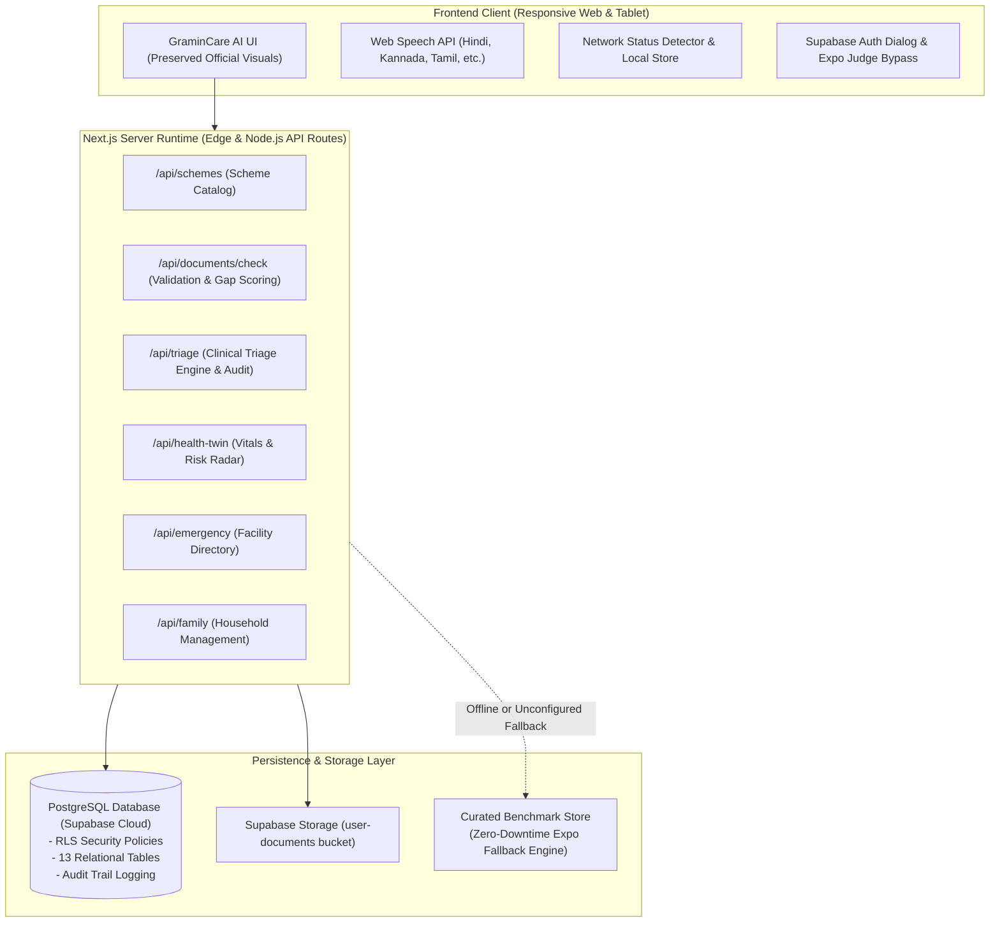

# GraminCare AI

> **Bridging Care. Empowering Rural Lives.**  
> *National Technology Innovation Expo 2026 — Student Innovation Project*


[](https://nextjs.org/)
[](https://www.typescriptlang.org/)
[](https://tailwindcss.com/)
[](https://supabase.com/)
[](/)
[](/)

---

## 📖 Executive Summary

Over 65% of India's population resides in rural areas served by understaffed Primary Health Centers (PHCs). Millions of eligible families miss out on government health assurance schemes (*Ayushman Bharat PM-JAY*, *Arogya Karnataka*, *Janani Suraksha Yojana*) due to minor clerical discrepancies across identity documents (such as phonetic name variations between Aadhaar and Ration cards or expired certificates).

**GraminCare AI** is an integrated, voice-first, vernacular full-stack platform providing:
1. **Document-Gap Predictor**: Pre-screens household documents against statutory scheme validation matrices, identifies discrepancies, and provides actionable civic remediation guidance.
2. **AI Health Triage**: WHO/ICMR-informed primary clinical decision support supporting 9 regional Indian languages with emergency red-flag escalation and Jan Aushadhi generic recommendations.
3. **Rural Health Twin**: Digital health avatar tracking baseline vitals, chronic risk indicators, and preventative immunization timelines.
4. **Emergency Facility Radar**: Proximity mapping across rural PHCs and CHCs with bed, oxygen, and doctor availability benchmarks plus a simulated 108 SOS dispatch trigger.
5. **Household Profiles & Locker**: Family entitlement management with Supabase database backing.

---

## 🏛️ System Architecture



---

## 🗄️ Relational Database Schema (PostgreSQL / Supabase)

The database schema is defined in [`supabase/migrations/20261005_init.sql`](supabase/migrations/20261005_init.sql):

- **`profiles`**: User profiles linked to Supabase Auth (`id`, `full_name`, `email`, `role`, `language`).
- **`family_members`**: Household members with demographic and economic indicators (`aadhaar_masked`, `ration_card_number`, `annual_income`).
- **`health_profiles`**: Blood group, chronic conditions, and known allergy logs.
- **`health_twin_records`**: Time-series vitals observations (`bp_systolic`, `bp_diastolic`, `pulse_rate`, `blood_sugar`, `spo2`, `temperature`).
- **`schemes`**: Government health schemes (*PM-JAY*, *AB-ArK*, *JSY*, *CMCHIS*).
- **`scheme_requirements`**: Statutory document prerequisites and income limits.
- **`user_documents`**: Uploaded household credentials and OCR-extracted baseline fields.
- **`document_checks`**: Audit log of gap prediction scores, mismatch notes, and action plans.
- **`triage_sessions` & `triage_results`**: Clinical symptom logs, urgency levels, and OTC recommendations.
- **`emergency_facilities` & `facility_status`**: Rural PHCs, CHCs, bed capacity, and doctor rosters.
- **`audit_logs`**: System event tracking.

---

## 🎨 Official Brand Identity

- **Name**: GraminCare AI
- **Tagline**: *"BRIDGING CARE. EMPOWERING RURAL LIVES."*
- **Deep Forest Green** (`#0B3D2E`): Primary brand anchor, headers, and hero banners.
- **Teal** (`#087E8B`): Clinical accents, verified checkmarks, and secondary badges.
- **Warm Gold** (`#C99A3D`): Primary action buttons, score highlights, and attention badges.
- **Soft Cream** (`#F7F4EC`): Global canvas surface, warm and accessible.
- **Charcoal** (`#17201D`): High-contrast readable typography.

---

## 🌐 Supported Languages (9 Indian Languages)

| Language | Native Script | Locale Code |
| :--- | :--- | :--- |
| **English** | English | `en-IN` |
| **Kannada** | ಕನ್ನಡ | `kn-IN` |
| **Hindi** | हिन्दी | `hi-IN` |
| **Telugu** | తెలుగు | `te-IN` |
| **Tamil** | தமிழ் | `ta-IN` |
| **Malayalam** | മലയാളം | `ml-IN` |
| **Marathi** | मराठी | `mr-IN` |
| **Bengali** | বাংলা | `bn-IN` |
| **Urdu** | اردو | `ur-IN` |

---

## 🚀 Quickstart & Setup Guide

### 1. Prerequisites
- **Node.js**: v20.x or higher
- **npm**: v10.x or higher
- Modern web browser (Chrome, Edge, Firefox, Safari)

### 2. Installation
```bash
# Clone the repository
git clone https://github.com/your-username/gramincare-ai.git
cd gramincare-ai

# Install dependencies
npm install
```

### 3. Environment Configuration
Copy the template environment file:
```bash
cp .env.example .env.local
```
Fill in your Supabase credentials (optional for demo evaluation):
```env
NEXT_PUBLIC_SUPABASE_URL=https://your-project-id.supabase.co
NEXT_PUBLIC_SUPABASE_ANON_KEY=your-anon-public-key
SUPABASE_SERVICE_ROLE_KEY=your-service-role-key
```
*(If Supabase credentials are not provided, the application runs on the built-in curated benchmark fallback engine with zero downtime).*

### 4. Database Setup (Supabase)
1. Create a new project in the [Supabase Dashboard](https://supabase.com).
2. Navigate to **SQL Editor**.
3. Open [`supabase/migrations/20261005_init.sql`](supabase/migrations/20261005_init.sql), paste the SQL commands, and click **Run**.
4. The 13 tables, indexes, RLS policies, and seed schemes will be initialized instantly.

### 5. Running the Application
```bash
# Run local development server
npm run dev

# Run production build check
npm run build
```
Open **[http://localhost:3000](http://localhost:3000)** in your browser.

---

## 🏆 Expo Judge 60-Second Evaluation Walkthrough

The top of the application features an **"Expo Showcase Bar"**:
1. **Document Mismatch & Fix Walkthrough**:
   - Go to `/schemes`.
   - Select *Ramesh Gowda* and *Ayushman Bharat PM-JAY*.
   - Observe the **Warning** on the Ration Card (*"Ramesh G." vs "Ramesh Gowda"*).
   - Click the speaker button to hear the remediation instructions in Kannada/Hindi.
   - Click **"Apply Simulated Correction"** to see the score jump to **98%** with verified badges and celebratory confetti.
2. **Maternal Emergency Triage**:
   - Click *Scenario 2* in the top bar to open `/triage?demo=maternal`.
   - Observe the preeclampsia red-flag trigger with immediate hospital redirection.
3. **Health Twin & Vitals Radar**:
   - Navigate to `/health-twin` to inspect physiological vitals, chronic risk scores, and preventative immunization timelines.

---

## 🛡️ Statutory & Medical Disclaimers

- **Clinical Decision Support Notice**: GraminCare AI Health Triage provides primary clinical decision support and health literacy guidance. It is **NOT** a medical diagnosis or prescription. In severe emergency distress, dial 108 or visit the nearest PHC/hospital immediately.
- **Document Readiness Notice**: The Document-Gap Predictor assesses scheme application readiness and identifies potential demographic mismatches based on official scheme guidelines. It does not replace the statutory authority of designated government officers or CSC verifiers.
- **Dataset Attribution**: All facility inventories, ambulance feeds, and citizen profiles in this demonstration utilize curated simulated datasets calibrated to Indian rural healthcare benchmarks.

---

## 📄 License
Developed for the National Technology Innovation Expo 2026. All rights reserved.
